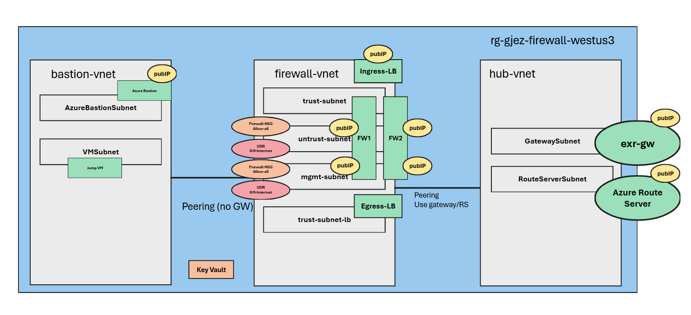

# Active/Active Palo BGP configuration for AVS installs

This repo contains Terraform code to build out an architecture for doing BGP testing for AVS installations in Azure.  This assumes you have an existing AVS private cloud and just need to configure a pair of Palo's for testing/demo purposes.  While technically this configuration could be used in a production scenario, it is sub-optimal for that purpose. The scripts configure the two Palo's independently of each other and use the BYOL license trial period for the testing.  You are welcome to modify this code to use Panorama and other configurations if desired but that would be at your discretion. Work with your Palo Alto representative to properly license any implementation.

## Installation instructions

Here are the steps required to leverage this configuration

### Pre-requisites

Ensure you have `git`, `az cli`, and `terraform` applications installed and configured in your deployment environment.  

### Get the code and setup the environment

1. Create a working directory for the code. (**mkdir working_dir**)
1. Clone the latest version of the repo's main branch. (`git clone <TODO: add repo details here>`)
1. Login to the azure cli and set the subscription context to your target subscription (`az login`)
1. Set the terraform ARM subscription is environment variable pointing to your subscription id
    1. Windows - **set ARM_SUBSCRIPTION_ID=<subscription id value>** (example `set ARM_SUBSCRIPTION_ID=000000000-0000-0000-0000-000000000000`)
    1. Linux - **export ARM_SUBSCRIPTION_ID=<subscription id value>** (example `export ARM_SUBSCRIPTION_ID=000000000-0000-0000-0000-000000000000`)

### Deploy the Azure Infrastructure components

This deployment happens in two parts due to how Terraform manages provider references. This section details how to deploy the Azure components. For the networking, I've preset the CIDR segmentation, so you'll want to use at least a /22 for each of the vnet CIDR's to avoid issues with minimum sizes for services like Azure Bastion.

1. Change directory to the palo_avs_bgp_config directory that you previously cloned. `cd palo_avs_bgp_config`
1. Open visual studio code. `code .`
1. Expand the `azure_infrastructure_root` directory.
1. Select the `example.auto.tfvars.sample` file and save the updated file as `example.auto.tfvars`.
1. Set the values you want to use in your deployment. 
1. Change directory to the azure_infrastructure_root sub directory. `cd azure_infrastructure_root`
1. Run `terraform init` on your command prompt to initialize the deployment providers.
1. Run `terraform apply` to initiate the deployment.  
1. Type `yes` to allow the deployment to continue.

> Note: In some cases the configuration may fail/stop for various reasons.  You should be able to re-run the terraform apply step and it will attempt to pick up where it left off.

### Deploy the Palo Alto configuration

Once the Azure infrastructure installation completes it will write out a number of outputs from resources that were created during the deploy.  We will use these values to build the Palo configuration.

> Note: It takes about 2-3 minutes for all of the firewall services to load.  If you move too quickly, this script will fail due to it not being able to login to the firewalls as the services will not have finished starting up.  If this happens, wait a few minutes and run the script again.

1. Change directory to the Palo root module directory.  `cd ../palo_config_root`
1. Return to visual studio code and open the `example.auto.tfvars.sample` file in the `palo_config_root` directory
1. Update the values in the file with the output values from the Azure Infrastructure deployment and save the updated file as `example.auto.tfvars`.
1. Run `terraform init` on your command prompt to initialize the deployment providers.
1. Run `terraform apply` to initiate the deployment.  
1. Type `yes` to allow the deployment to continue.

> Note: In some cases the configuration may fail/stop for various reasons.  You should be able to re-run the terraform apply step and it will attempt to pick up where it left off.

### Login and commit the changes

The Panos terraform provider doesn't currently provide a mechanism to commit changes as part of the code.  You will instead need to login to the firewalls and commit changes manually. Because this is an HA configuration of two standalone firewalls you will need to commit the changes individually on each firewall.

1. Log into the Azure portal and find the newly created resource group
1. Locate the management public IP address for the first firewall.
1. Open a browser tab and enter https://<public ip address from the previous step>
1. Accept the risk of the self-signed certificates on the Palo
1. Enter the username that was included in the .tfvars files.  This defaults to azureuser if you didn't change it.
1. Return to the portal and locate the keyvault resource that was deployed.
1. Open the key vault secrets and find the secret for the first node of the firewall.
1. Copy the secret value into the clipboard
1. Return to the Palo login and paste the value into the login screen.
1. Once the Palo completes the login, clear all of the startup messages.
1. Select `commit` and review the changes being committed and apply the changes.
1. Repeat these steps for the second firewall.

### Connect AVS to the hub (Optional)

This set of scripts does not include an AVS deployment as part of the configuration. They also don't automatically create an ExpressRoute connection to the AVS environment.  If you want to attach an AVS environment, you can do so by generating an ExpressRoute key and configuring an expressRoute connection to the Virtual Network Gateway deployed as part of this Terraform configuration.

> Note: This deployment includes a jump virtual machine and a Bastion environment to allow for testing and AVS management. To access the jump host, login using Bastion. The username will be the same as what was used to configure the Palo Alto firewalls, and there is a separate password stored as a secret in the key vault.
